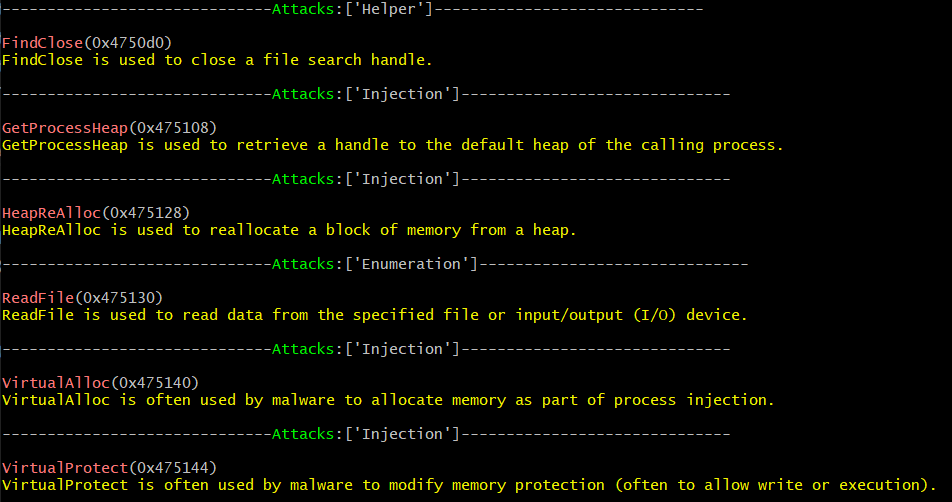

# MalFinder
This tool takes a PE file (e.g. *.exe) and checks if the Import Address Table (IAT) contains a suspicious function that is usually used in malware.
The process is done by checking if the function name is present at https://malapi.io/ . If so, the tool returns the description of the function and what it is used for.

## Installation

```
# Virtual environment
python3 -m venv MalFinderVE
cd MalFinderVE
source Scripts/activate
git clone https://github.com/J0eBinary/MalFinder.git
cd MalFinder
pip3 install -r requirements.txt
```
## Dependencies:

MalFinder depends on the `requests`, `pefile`, `sys` and `bs4` python modules.

These dependencies can be installed using the requirements file:
```
pip3 install -r requirements.txt
```

## Usage
```python
options = [ --no-color, --update ]
python3 MalFinder.py [file] [options]
# Check if there're any updates in APIs.
python3 MalFinder.py --update
python3 MalFinder.py malware.exe 
python3 MalFinder.py mal_library.dll
```



### Contact 
* X: [J0e_Binary](https://twitter.com/j0e_Binary)
* X: [0xNuLLByte](https://twitter.com/0xNuLLByte)

## Version
**Current version is 1.0**
